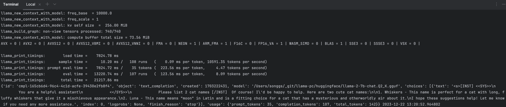

# 如何在PC上运行大模型
在PC上使用CPU运行大模型不如使用GPU高效，但仍然是可以实现的大模型推理。   
大模型训练要求的资源更高，这里直接使用面向开源的Facebook's LLaMA model(llama-2-7b-chat.Q2_K.gguf)。   
连接CPU与LLaMA model的是[llama.cpp](https://github.com/ggerganov/llama.cpp)。   
为方便使用，添加了简单的server和UI。

## 准备
1. 下载模型  
huggingface: https://huggingface.co/TheBloke/Llama-2-7B-Chat-GGUF/tree/main
baidu disk: https://pan.baidu.com/s/1YvAYrDD6DfoxpwD2kT5n3w?pwd=1234
2. 配置开发环境及源码
```
poetry
python = "^3.12"
llama-cpp-python = "^0.2.20"
flask = "3.0.0"
flask-restx = "^1.3.0"

源码 https://github.com/Song2017/llama-pc/blob/main/llama_pc/server.py

import datetime
import os

from flask import Flask, jsonify
from flask_restx import Api, Resource, fields
from llama_cpp import Llama

model = None
_model_path = os.getenv("MODEL_PATH") or "/Users/songgs/_git/llama-pc/huggingface/llama-2-7b-chat.Q2_K.gguf"
_system_message = "You are a helpful assistant"
_max_tokens = 500

# Create a Flask object
app = Flask("Llama server")
api = Api(app, version='1.0', title='miniGPT', description='Service')
ns = api.namespace('LLM GPT', description='LLM GPT')
todo = api.model('LLM', {
    'system_message': fields.String(description='system_message', default=_system_message),
    'user_message': fields.String(required=True, description='The task details', default="Please list 2 cat names")
})


@ns.route('/llm')
class Demo(Resource):
    def get(self):
        return "llm"

    @ns.expect(todo)
    def post(self):
        return generate_response(data={"user_message": api.payload.get("user_message")})


def generate_response(data: dict):
    global model
    start_time = datetime.datetime.now()
    try:
        system_message = data.get("system_message") or _system_message
        max_tokens = int(data['max_tokens']) if 'max_tokens' in data else _max_tokens

        # Check if the required fields are present in the JSON data
        if 'user_message' in data:
            user_message = data['user_message']

            # Prompt creation
            prompt = f"""<s>[INST] <<SYS>>
            {system_message}
            <</SYS>>
            {user_message} [/INST]"""
            # Create the model if it was not previously created
            if model is None:
                # Create the model
                model = Llama(model_path=_model_path)

            # Run the model
            output = model(prompt, max_tokens=max_tokens, echo=True)
            print(output, datetime.datetime.now())
            choice_text = output.get("choices", [{}])[0].get("text")
            choice_text.replace(prompt, "")
            return jsonify({
                "question": user_message,
                "timing": str(datetime.datetime.now() - start_time),
                "choice": choice_text.replace(prompt, "").lstrip(),
            })

        else:
            return jsonify({"error": "Missing required parameters"}), 400

    except Exception as e:
        return jsonify({"Error": str(e)}), 500


if __name__ == '__main__':
    app.run(host='0.0.0.0', port=8000)
```

## 运行
```
export MODEL_PATH='/Users/_git/llama-pc/huggingface/llama-2-7b-chat.Q2_K.gguf'
# poetry run python ./llama_pc/server.py
python ./llama_pc/server.py
```
## 推理结果


## refer
- https://github.com/ggerganov/llama.cpp
- https://medium.com/@penkow/how-to-run-llama-2-locally-on-cpu-docker-image-731eae6398d1
